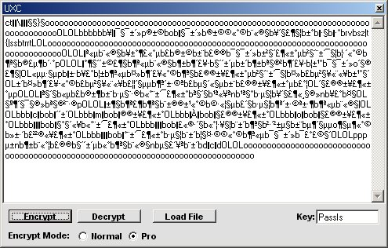



## Simple powerful UXC Encryption \(Try to crack my sample file :\) \)

### Description

This is a simple encryption routine I call UXC. I made it for my game files. Please give it a try!! Try to crack the sample .txt file and if you can post what it says here :) I want to see how hard or easy this is to crack so I can update it. Enjoy! Please vote and let me know what you think so I can improve it.
 
### More Info
 

             |
---                |---
**Submitted On**   |2002-06-23 19:48:12
**By**             |[James Dougherty](https://github.com/Planet-Source-Code/PSCIndex/blob/master/ByAuthor/james-dougherty.md)
**Level**          |Intermediate
**User Rating**    |4.3 (13 globes from 3 users)
**Compatibility**  |VB 6\.0
**Category**       |[Encryption](https://github.com/Planet-Source-Code/PSCIndex/blob/master/ByCategory/encryption__1-48.md)
**World**          |[Visual Basic](https://github.com/Planet-Source-Code/PSCIndex/blob/master/ByWorld/visual-basic.md)
**Archive File**   |[Simple\_pow979116232002\.zip](https://github.com/Planet-Source-Code/james-dougherty-simple-powerful-uxc-encryption-try-to-crack-my-sample-file__1-36189/archive/master.zip)

